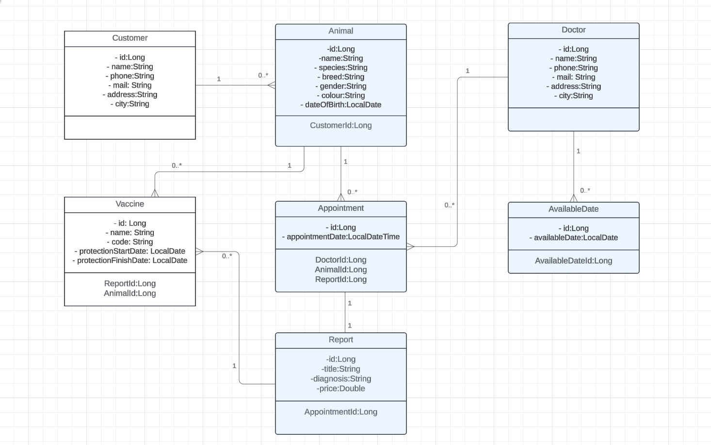

# React + Vite

This template provides a minimal setup to get React working in Vite with HMR and some ESLint rules.

Currently, two official plugins are available:

- [@vitejs/plugin-react](https://github.com/vitejs/vite-plugin-react/blob/main/packages/plugin-react/README.md) uses [Babel](https://babeljs.io/) for Fast Refresh
- [@vitejs/plugin-react-swc](https://github.com/vitejs/vite-plugin-react-swc) uses [SWC](https://swc.rs/) for Fast Refresh

Vet Management System 

Created vet system. Used technologies are Java Spring Boot and PostgreSQL.

Project Description

With the veterinary management system project, we created a system where a veterinary clinic can manage its own business.

The application will be used by veterinarians.
veterinary doctors will register,

-Doctors working days (available days) will be recorded, recorded as a date without a time,

-will register customers,

-will register customers animals,

-record the vaccinations applied to animals together with their dates,

-They will make appointments with veterinarians for animals,

-Date and time will be entered when creating an appointment,

-When making an appointment, both the doctor's available days should be checked without a time, and the date and time should be checked from the appointment records. If there is no conflict in the records, an appointment should be created.

UML Diagram

API End points

| HTTP Method |         EndPoint         |       Description        |
|:-----------:|:------------------------:|:------------------------:|
|    POST     |       v1/customers       |  Create a new customer   |
|     GET     |       v1/customers       |    Fetch all customer    |
|     PUT     |    v1/customers/{id}     | Update a customer by id  |
|   DELETE    |    v1/customers/{id}     | Delete a customer by id  |
|     GET     |    v1/customers/{id}     |  Fetch a customer by id  |
|     GET     | v1/customers/name/{name} | Fetch a customer by name |

| HTTP Method |                 EndPoint                 |                Description                 |
|:-----------:|:----------------------------------------:|:------------------------------------------:|
|    POST     |               v1/vaccines                |           Create a new vaccines            |
|     GET     |               v1/vaccines                |             Fetch all vaccines             |
|     PUT     |             v1/vaccines/{id}             |          Update a vaccines by id           |
|   DELETE    |             v1/vaccines/{id}             |          Delete a vaccines by id           |
|     GET     |             v1/vaccines/{id}             |           Fetch a vaccines by id           |
|     GET     |         v1/vaccines/animal/{id}          |       Fetch a vaccines by animal id        |
|     GET     | v1/vaccines/date?start-date=?&end-date=? | Fetch a protection finish vaccines by date |

| HTTP Method |        EndPoint        |          Description           |
|:-----------:|:----------------------:|:------------------------------:|
|    POST     |       v1/animals       |      Create a new animals      |
|     GET     |       v1/animals       |       Fetch all animals        |
|     PUT     |    v1/animals/{id}     |     Update a animals by id     |
|   DELETE    |    v1/animals/{id}     |     Delete a animals by id     |
|     GET     |    v1/animals/{id}     |     Fetch a animals by id      |
|     GET     | v1/animals/name/{name} | Fetch a animals by animal name |

| HTTP Method |        EndPoint        |      Description       |
|:-----------:|:----------------------:|:----------------------:|
|    POST     |       v1/doctors       |  Create a new doctor   |
|     GET     |       v1/doctors       |    Fetch all doctor    |
|     PUT     |    v1/doctors/{id}     | Update a doctors by id |
|   DELETE    |    v1/doctors/{id}     | Delete a doctors by id |
|     GET     |    v1/doctors/{id}     | Fetch a doctors by id  |
|     GET     | v1/doctors/name/{name} | Fetch a doctor by name |

| HTTP Method |                                  EndPoint                                   |                         Description                         |
|:-----------:|:---------------------------------------------------------------------------:|:-----------------------------------------------------------:|
|    POST     |                                  v1/dates                                   |                Create a new available dates                 |
|     GET     |                                  v1/dates                                   |                  Fetch all available dates                  |
|     PUT     |                                v1/dates/{id}                                |                Update a available date by id                |
|   DELETE    |                                v1/dates/{id}                                |                Delete a available date by id                |
|     GET     |                                v1/dates/{id}                                |                Fetch a available date by id                 |
|     GET     |           v1/dates/date?start-date={startDate}&end-date={endDate}           |      Fetch a available date by start date and end date      |
|     GET     | v1/dates/doctor?start-date={startDate}&end-date={endDate}&name={doctorName} | Fetch a available date by doctor name and two dates between |

| HTTP Method |                       EndPoint                        |                        Description                        |
|:-----------:|:-----------------------------------------------------:|:---------------------------------------------------------:|
|    POST     |                v1/appointments/{date}                 |             Create a new appointments by date             |
|     GET     |                    v1/appointments                    |                  Fetch all appointments                   |
|     PUT     |                 v1/appointments/{id}                  |                Update a appointments by id                |
|   DELETE    |                 v1/appointments/{id}                  |                Delete a appointments by id                |
|     GET     |                 v1/appointments/{id}                  |                Fetch a appointments by id                 |
|     GET     | v1/appointments/animal?name=?&start-date=?&end-date=? | Fetch a appointments by animal name and two dates between |
|     GET     | v1/appointments/doctor?name=?&start-date=?&end-date=? | Fetch a appointments by doctor name and two dates between |
|     GET     |     v1/appointments/date?start-date=?&end-date=?      |         Fetch a appointments by two dates between         |
|     GET     |       v1/appointments/animal-name/{animalName}        |            Fetch a appointments by animal name            |
|     GET     |       v1/appointments/doctor-name/{doctorName}        |            Fetch a appointments by doctor name            |

| HTTP Method |                       EndPoint                        |                        Description                        |
|:-----------:|:-----------------------------------------------------:|:---------------------------------------------------------:|
|    POST     |                   v1/reports/{date}                   |                   Create a new reports                    |
|     GET     |                      v1/reports                       |                     Fetch all reports                     |
|     PUT     |                    v1/reports/{id}                    |                  Update a reports by id                   |
|   DELETE    |                    v1/reports/{id}                    |                  Delete a reports by id                   |
|     GET     |                    v1/reports/{id}                    |                   Fetch a reports by id                   |

Sayfa Linki: https://vet-frontend-three.vercel.app/
